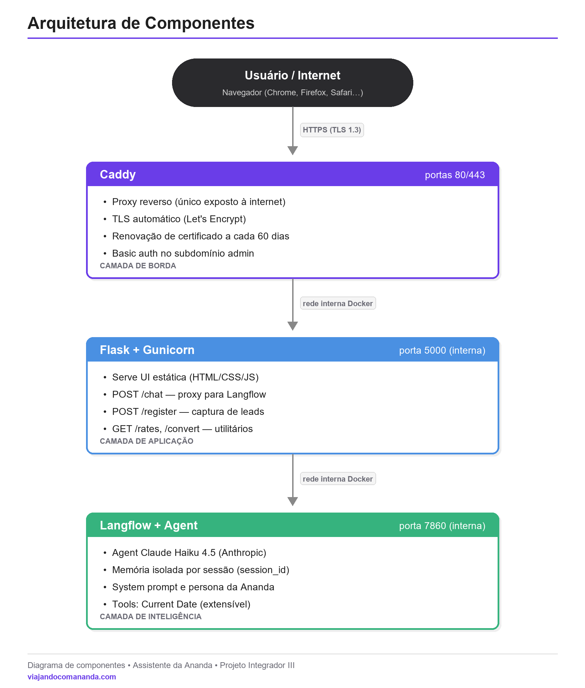

# Viajando com Ananda — Conversational AI Assistant for Study Abroad

> An AI assistant that helps Brazilian students planning to study or move abroad — answering the recurring questions about visas, costs, countries and everyday life, 24/7, in a content creator's own voice.

[](https://viajandocomananda.com)
[](https://viajandocomananda.com)
[](https://www.python.org/)
[](#license)

> ⚠️ **Beta / Work in progress.** This project is live in production but still under active development. Features, the knowledge base and the AI behaviour are being refined continuously — expect changes.

🔗 **Live demo:** https://viajandocomananda.com

---

## What it is

A conversational web app built for the content creator **Ananda**, who receives a large volume of questions from followers interested in studying/living abroad. Answering each one by hand doesn't scale — so this assistant does it 24/7, captures qualified leads (with GDPR/LGPD-compliant consent), and gives the creator an admin panel to manage everything.

It started as a capstone/extension project and grew into a real product running on its own domain, with HTTPS, security hardening and a tight (~€6/month) infrastructure budget.

## Features

- 🤖 **Conversational AI** — an agent orchestrated in [Langflow](https://www.langflow.org/) using **Claude (Anthropic)**, with **per-session memory isolation** (context never leaks between users).
- 📚 **RAG knowledge base** — answers grounded in curated study-abroad content.
- 📝 **GDPR/LGPD-compliant lead capture** — granular, opt-in, versioned consent; leads stored as JSON Lines.
- 🛠️ **Admin panel** — browse/search leads, paginate, export to CSV, and review full conversation histories per session and per user.
- 💱 **Utilities** — live currency rates and a converter (BRL/USD/EUR/GBP) via the Frankfurter API.
- 🚦 **Abuse control** — per-IP rate limiting (hour/day) backed by Redis.
- 🎨 **Polished UX** — light/dark theme, suggested questions, Markdown rendering, and in-browser conversation history.

## Architecture

The app runs as independent layers on a Docker internal network — only the Caddy reverse proxy is exposed to the internet.



**Request flow (panels):**

```
Visitor → Cloudflare Access (SSO + email OTP)        ← edge: only authorised email passes
        → Cloudflare injects a shared-secret header  ← Request Header Transform Rule
        → Caddy enforces the secret (else 403)       ← origin: blocks direct-IP access
        → Flask / Langflow
```

## Tech stack

| Layer | Technology |
|-------|------------|
| Backend | Python 3.11, Flask, Gunicorn |
| AI | Langflow + Claude (Anthropic), RAG knowledge base |
| Frontend | HTML5, CSS3, vanilla JavaScript (no framework) |
| Data / abuse control | JSON Lines lead store, Redis rate limiting |
| Reverse proxy | Caddy (automatic HTTPS via Let's Encrypt) |
| Infrastructure | Docker Compose on a Linux VPS (Hetzner) |
| Security | Cloudflare DNS + Zero Trust Access, origin shared-secret, hardened headers |
| Ops | Watchtower (auto-updates), Docker log rotation |

## How it works

1. On first visit, a **sign-up modal** collects name, phone and email with granular consent — turning each visitor into a qualified, consented lead.
2. Messages are sent to the **Flask backend** (`POST /chat`), which forwards them to the **Langflow** agent, passing a `session_id` so the memory component only reads the current user's conversation.
3. The agent grounds its answers in the **RAG knowledge base** and replies in Markdown.
4. The creator manages leads and reviews conversations through the **admin panel**, served on a separate, access-controlled subdomain.

## Getting started

### Prerequisites
- Docker & Docker Compose
- A running Langflow flow (you'll need its `FLOW_ID`, an API key and the Memory component ID)

### 1. Configure environment
```bash
cp .env.example .env
# then fill in the values (see comments in .env.example)
```

Key variables:
- `LANGFLOW_BASE_URL`, `FLOW_ID`, `LANGFLOW_API_KEY`, `MEMORY_COMPONENT_ID` — connect to your Langflow flow.
- `ORIGIN_SHARED_SECRET` — the secret Cloudflare injects and Caddy enforces on the admin panels (`openssl rand -hex 32`).

### 2. Run
```bash
docker compose up -d --build
```

The stack starts Langflow, Redis, the Flask app and Caddy. Caddy handles HTTPS automatically for the configured domains (adjust the hostnames in the `Caddyfile` to your own).

### Local development (without Docker)
```bash
pip install -r requirements.txt
export $(grep -v '^#' .env | xargs)   # or use a .env loader
flask --app app run   # serves on http://127.0.0.1:5000
```

## Project structure

```
app.py                 # Flask app: chat, lead capture, utilities, admin panel
templates/             # HTML (chat UI + admin pages)
static/                # chat.js, style.css
knowledge/             # RAG knowledge base (study-abroad FAQ)
Caddyfile              # reverse proxy, HTTPS, security headers, origin-secret enforcement
docker-compose.yml     # langflow · redis · flask · caddy · watchtower
Dockerfile             # Flask image (python:3.11-slim + gunicorn)
docs/                  # architecture diagram, planning docs
```

## Security

- **Cloudflare Access (Zero Trust)** gates the admin and Langflow panels with SSO + email one-time-PIN.
- **Origin shared-secret** — Cloudflare injects a secret header that Caddy requires; direct-to-origin requests without it are rejected with `403`.
- **Hardened HTTP headers** (HSTS, `X-Content-Type-Options`, `X-Frame-Options`, `Referrer-Policy`).
- **Automatic HTTPS** via Caddy + Let's Encrypt.
- **Per-IP rate limiting** to protect against abuse and control LLM costs.

## Roadmap

- [ ] Expand the RAG base with the creator's real content (videos, posts, transcripts)
- [ ] System-prompt refinement (tone of voice, guardrails)
- [ ] Web-search tool for always-up-to-date visa/immigration info
- [ ] Human handover for high-intent leads
- [ ] Additional channels (WhatsApp, Instagram DM, Telegram)

## License

**© 2026 Gabriel Shimabuko. All rights reserved.**

This source code is published for **portfolio and evaluation purposes only**. It may **not** be used, copied, modified, distributed, or used commercially without prior written permission. Commercial use requires a separate commercial license from the author. See [LICENSE](LICENSE) for the full terms.

For licensing or commercial inquiries, reach out via [GitHub](https://github.com/gazz-w).

## Author

**Gabriel Shimabuko** — [GitHub](https://github.com/gazz-w) · Building production LLM chatbots and conversational AI. Based in Cork, Ireland.
